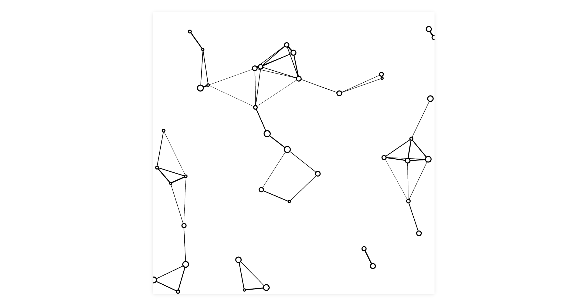

# Particles Canvas

<div align="center">
   
</div

## Getting Started

```bash
# Clone the repo
git clone https://github.com/AsyrafHussin/particles.git

# Navigate to project folder
cd particles

# Initial Setup
npm install

# Serve the application on http://192.168.58.97:9966/
npx canvas-sketch src/index.js
```

## Demo

[https://particles-canvas.vercel.app/](https://particles-canvas.vercel.app/)

## License

MIT. See [LICENSE](LICENSE) for more details.
